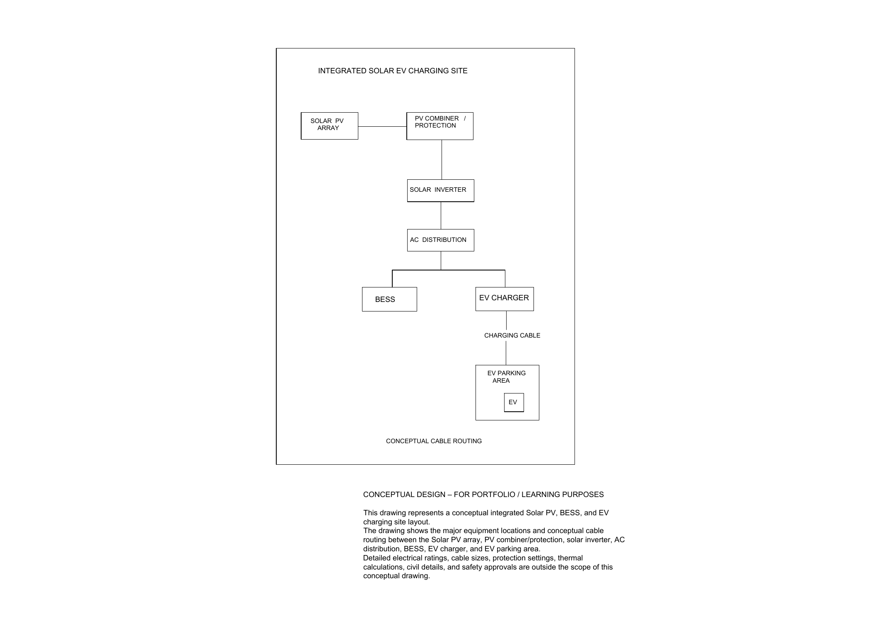
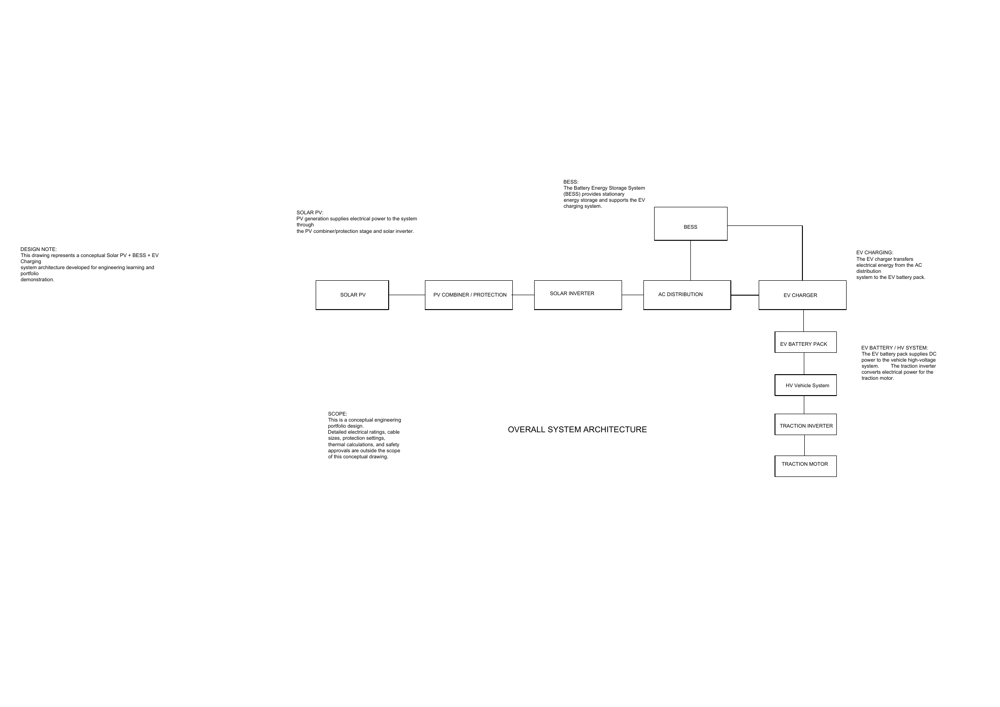

# Solar-Powered EV Charging + Battery Energy Storage + EV Battery Pack

### Electrical & Systems Engineering Portfolio Project

**Author:** Gowtham Mekala



> **CONCEPTUAL DESIGN NOTICE:** This is a portfolio / learning project. It is not a construction-ready electrical design. See [Design Scope & Limitations](#design-scope--limitations).

## Project Overview

This project presents a conceptual electrical and systems engineering design integrating:

- Solar PV generation
- EV charging infrastructure
- Stationary Battery Energy Storage System (BESS)
- EV battery pack architecture
- High-voltage EV vehicle architecture
- Electrical system documentation and verification planning

## System Architecture

Conceptual power and energy flow:

**Solar PV -> PV Combiner / Protection -> Solar Inverter -> AC Distribution -> BESS / EV Charger -> EV (on-board charger) -> EV Battery -> HV Vehicle System -> Traction Inverter -> Traction Motor**



## Conceptual Engineering Calculations

[`Design_Calculations.xlsx`](08_Engineering_Documentation/Design_Calculations.xlsx) contains a formula-driven worked example supporting selected architectural decisions. All inputs are illustrative and editable (blue cells). The workbook currently reports **24/24 defined calculation checks passing**.

| Item | Result |
|---|---|
| Charging load | 2 x 32 A single-phase AC chargers (7.36 kW each), 80 kWh/day |
| PV array | 24 x 550 Wp = 13.2 kWp (2 strings of 12), string Voc (cold) 618 V |
| Solar inverter | 12 kW, 3-phase, DC/AC ratio 1.10 |
| Estimated solar share | 56 % of charging energy; grid import about 35 kWh/day |
| BESS | 6 x 5.12 kWh = 30.7 kWh nominal (26.3 kWh usable), 10 kW PCS |
| EV pack | 96S2P, 350 V nominal, 59.6 kWh nominal |
| Site cables | CBL-001 to CBL-006 sized for ampacity and voltage drop (see Cable_Schedule.xlsx) |

**Important:** The numerical results are illustrative portfolio calculations. The checks validate the implemented calculation cases only. Passing them does not imply that the system is safe, standards-compliant, construction-ready, or suitable for real-world deployment.

## CAD Drawings

The project contains 10 conceptual engineering drawings (PDF in `09_PDF`, PNG in `10_Images`, DWG in `11_Source_Files/AutoCAD`):

| Drawing | Description |
|---|---|
| EVD-001 | Overall System Architecture |
| EVD-002 | Solar PV Electrical Layout |
| EVD-003 | Solar PV Single-Line Diagram |
| EVD-004 | EV Charging Station Layout |
| EVD-005 | EV Charging Station Single-Line Diagram |
| EVD-006 | Stationary BESS Layout |
| EVD-007 | EV Battery Pack Layout |
| EVD-008 | EV Battery Electrical Architecture |
| EVD-009 | EV HV Vehicle Architecture |
| EVD-010 | Integrated Site Layout + Cable Routing |

Planned drawing updates are listed in [`Open_Items.md`](08_Engineering_Documentation/Open_Items.md).

## Engineering Documentation

All files are in `08_Engineering_Documentation`:

| File | Content |
|---|---|
| System_Requirements.xlsx | SYS-001 to SYS-014 (conceptual and quantitative requirements) |
| Requirements_Traceability.xlsx | Requirement -> drawing / calculation -> verification |
| Verification_Plan.xlsx | VER-001 to VER-014 |
| Interface_Matrix.xlsx | INT-001 to INT-017 |
| BOM.xlsx | BOM-001 to BOM-018 (illustrative values, TBD where not justified) |
| Cable_Schedule.xlsx | CBL-001 to CBL-015 |
| Design_Calculations.xlsx | Worked sizing example with PASS/FAIL checks |
| Design_Assumptions.md | Assumptions and limitations |
| Open_Items.md | Known gaps and follow-up work |

## Requirements & Verification

**Requirement -> Design -> Verification**

Requirements SYS-001 to SYS-007 are conceptual (review / inspection of drawings). SYS-008 to SYS-014 are quantitative and are verified by analysis in Design_Calculations.xlsx. Verification status is marked "Complete (illustrative)" only where the calculation exists and its checks pass.

## Engineering Workflow

```text
Requirement -> Architecture -> Design -> Calculation -> Documentation -> Verification
```

## Tools Used

AutoCAD, Microsoft Excel, GitHub, GitHub Desktop, Markdown

## Project Structure

```text
Gowtham_Mekala_Solar_EV_Charging_System_Design-main/
|
|-- 08_Engineering_Documentation/   requirements, BOM, cables, interfaces, verification, calculations
|-- 09_PDF/                         drawing PDFs (EVD-001 to EVD-010)
|-- 10_Images/                      drawing PNGs (EVD-001 to EVD-010)
|-- 11_Source_Files/
|   `-- AutoCAD/                    DWG source files
|-- .gitattributes
|-- .gitignore
`-- README.md
```

## Design Scope & Limitations

**CONCEPTUAL DESIGN - FOR PORTFOLIO / LEARNING PURPOSES**

This project is intended for educational and portfolio demonstration purposes.

It is **not a construction-ready electrical design**.

Detailed electrical ratings, protection settings, short-circuit and earthing studies, thermal calculations, civil details, communication specifications, safety approvals, and other implementation-specific engineering requirements are outside the scope of this conceptual project. Example values in Design_Calculations.xlsx are illustrative and are not taken from real datasheets or a specific standard edition. Values marked **TBD** have intentionally not been assigned.

## Revision History

| Rev | Date | Change |
|---|---|---|
| A | 2026 | Initial conceptual release |
| B | 2026-10 | README structure fixed; spreadsheets cleaned and de-duplicated; Design_Calculations.xlsx added; AC charging with on-board charger; requirements, interfaces, BOM and cable schedule extended; all drawing PNGs exported |
| C | 2026-10 | README polished: preview image, calculation wording and disclaimer, engineering workflow |

## Author

**Gowtham Mekala**

Electrical & Systems Engineering Portfolio Project
